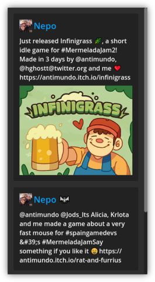

# mastodon-viewer-godot

A simple Control node for Godot to see a Mastodon user timeline.

## How to use

Use the `MastodonViewer` node and set up it's parameter:

1. Set up your Mastodon server URL (example): `https://mastodon.gamedev.place`
2. Set up your Mastodon user id (example): `109282546179741156`
> To see what your user id use: `[server_url]/api/v1/accounts/lookup?acct=[username]`. (example): `https://mastodon.gamedev.place/api/v1/accounts/lookup?acct=ANTIMUNDO`
